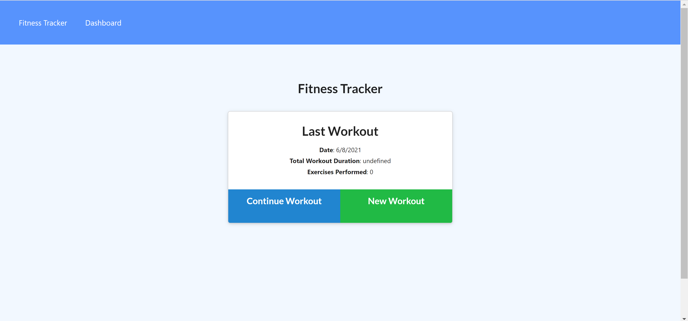
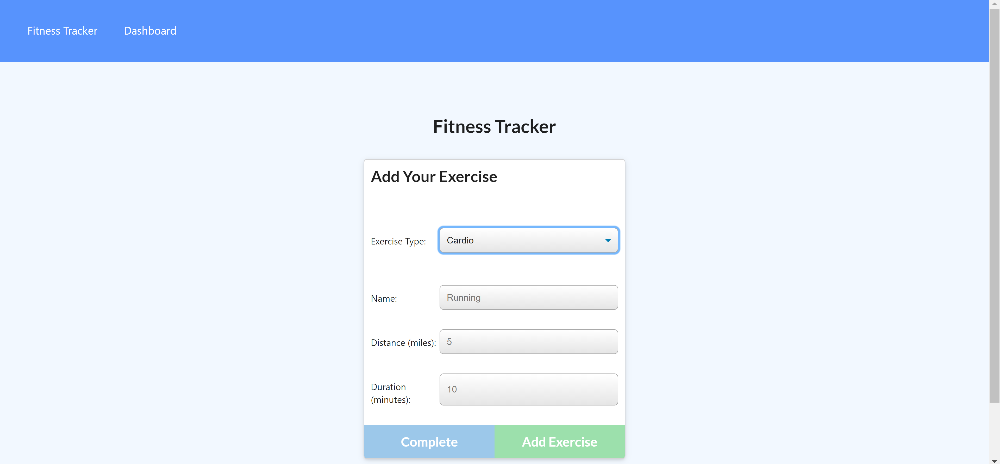
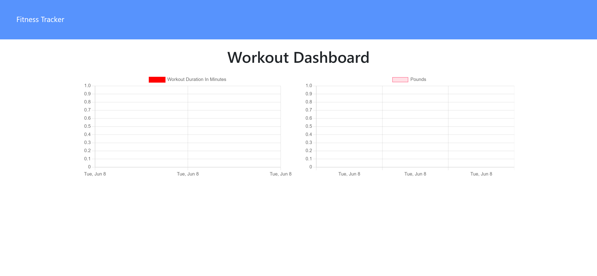

# 17 NoSQL
# Workout Tracker

This application allows users to view, create, and track daily workouts.

The deployed application can be found [here](https://esd-workout-tracker.herokuapp.com/). The application's GitHub repository can be found [here](https://github.com/elisesamanthadaly/Unit-17-NoSQL).

## Usage

On the landing page, click "New Workout" to enter information for a new workout. After entering all fields, select either "Complete" or "Add Exercise." Completing an exercise prevents further modification to it. Adding the exercise allows for it to be continued later. Click "Fitness Tracker" in the upper lefthand corner to be taken back to the landing page.

Click "Continue Workout" to modify an existing workout. You must enter the existing workout's name to do so. As before, click "Complete" or "Add Exercise" to finish your modification.

The Dashboard is not currently functional.

## Credits

Application front-end provided by UNC Coding Bootcamp as starter code.

## License

MIT License

Copyright (c) 2021 Elise Daly

Permission is hereby granted, free of charge, to any person obtaining a copy
of this software and associated documentation files (the "Software"), to deal
in the Software without restriction, including without limitation the rights
to use, copy, modify, merge, publish, distribute, sublicense, and/or sell
copies of the Software, and to permit persons to whom the Software is
furnished to do so, subject to the following conditions:

The above copyright notice and this permission notice shall be included in all
copies or substantial portions of the Software.

THE SOFTWARE IS PROVIDED "AS IS", WITHOUT WARRANTY OF ANY KIND, EXPRESS OR
IMPLIED, INCLUDING BUT NOT LIMITED TO THE WARRANTIES OF MERCHANTABILITY,
FITNESS FOR A PARTICULAR PURPOSE AND NONINFRINGEMENT. IN NO EVENT SHALL THE
AUTHORS OR COPYRIGHT HOLDERS BE LIABLE FOR ANY CLAIM, DAMAGES OR OTHER
LIABILITY, WHETHER IN AN ACTION OF CONTRACT, TORT OR OTHERWISE, ARISING FROM,
OUT OF OR IN CONNECTION WITH THE SOFTWARE OR THE USE OR OTHER DEALINGS IN THE
SOFTWARE.
